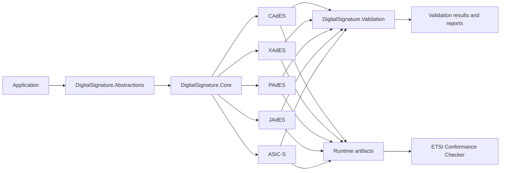

# DigitalSignature

<p align="center">
  <strong>.NET 10 toolkit for ETSI-style digital signatures</strong><br/>
  CAdES, XAdES, PAdES, JAdES, and ASiC-S in one consistent codebase.
</p>

<p align="center">
  Build real artifacts, validate them locally, and check interoperability against the ETSI Conformance Checker.
</p>

<p align="center">
  
  
  
  
</p>

---

DigitalSignature is a modular .NET 10 library for teams that want one practical implementation surface across the main ETSI signature families instead of separate format-specific stacks.

It is built around a simple idea: generate actual signature artifacts, not just model objects, then verify them both locally and with external conformance tooling.

## Why this project stands out

<table>
  <tr>
    <td valign="top" width="25%">
      <strong>One programming model</strong><br/>
      Shared abstractions for signing, timestamping, augmentation, and validation across families.
    </td>
    <td valign="top" width="25%">
      <strong>Real runtime artifacts</strong><br/>
      The repo generates actual <code>.p7m</code>, <code>.xml</code>, <code>.pdf</code>, <code>.json</code>, and <code>.asics</code> outputs.
    </td>
    <td valign="top" width="25%">
      <strong>Checker-backed interoperability</strong><br/>
      The current runtime demo set passes ETSI checker validation across B, T, LT, and LTA.
    </td>
    <td valign="top" width="25%">
      <strong>Modular layout</strong><br/>
      The solution is already split into package-sized modules for future NuGet-friendly consumption.
    </td>
  </tr>
</table>

## At a glance

| Area | Status |
|---|---|
| Signature families | **CAdES, XAdES, PAdES, JAdES, ASiC-S** |
| Supported levels | **Baseline-B, Baseline-T, Baseline-LT, Baseline-LTA** |
| Runtime demo outputs | **24 signature artifacts + demo certificates** |
| ETSI conformance sweep | **20 / 20 PASS** |
| Validation style | **Local verification + ETSI checker verification** |
| JAdES persistence model | **JSON General Serialization first** |

## Format coverage

| Family | Typical artifact | What the repo produces |
|---|---|---|
| **CAdES** | `.p7s`, `.p7m` | Detached and attached CMS/CAdES signatures, timestamps, LT material, LTA archive timestamps |
| **XAdES** | `.xml` | XML signatures with timestamp, validation material, and archive timestamp support |
| **PAdES** | `.pdf` | PDF signatures with DSS/VRI support and LTA via `DocTimeStamp` |
| **JAdES** | `.json`, `.jws` | Compact helper output for B, JSON General Serialization for T/LT/LTA |
| **ASiC-S** | `.asics` | Single-file containers carrying embedded CAdES signatures through LTA |

## Validation status

The current runtime artifact set passes both local verification and a fresh ETSI Conformance Checker sweep across all rows below.

| Format | B | T | LT | LTA | Local Validation | ETSI Checker | Implementation detail |
|---|---:|---:|---:|---:|---|---|---|
| CAdES | ✅ | ✅ | ✅ | ✅ | Pass | Pass | `archiveTimestampV3` with embedded `ATSHashIndexV3` |
| XAdES | ✅ | ✅ | ✅ | ✅ | Pass | Pass | `xades141:ArchiveTimeStamp` |
| PAdES | ✅ | ✅ | ✅ | ✅ | Pass | Pass | PDF `DocTimeStamp` with `ETSI.RFC3161` |
| ASiC-S | ✅ | ✅ | ✅ | ✅ | Pass | Pass | Embedded CAdES carried inside the container |
| JAdES | ✅ | ✅ | ✅ | ✅ | Pass | Pass | JSON General Serialization with `arcTst` for LTA |

## Try it locally

### Build and test

```bash
dotnet restore DigitalSignature.slnx
dotnet build DigitalSignature.slnx
dotnet test DigitalSignature.slnx
```

### Generate the runtime demo set

```bash
dotnet run --project samples/DigitalSignature.ArtifactDemo/DigitalSignature.ArtifactDemo.csproj -- artifacts/runtime-demo
```

That demo currently produces:

- ASiC-S: B, T, LT, LTA
- CAdES: detached B, attached B/T/LT/LTA
- XAdES: B, T, LT, LTA
- JAdES: compact B, JSON B/T/LT/LTA
- PAdES: B, T, LT, LTA

Representative output files include:

```text
sample-asic-lta.asics
sample-cades-lta.p7m
sample-xades-lta.xml
sample-jades-lta.json
sample-pades-lta.pdf
```

## Minimal example

```csharp
using System.Security.Cryptography;
using System.Security.Cryptography.X509Certificates;
using DigitalSignature.Abstractions;
using DigitalSignature.CAdES;
using DigitalSignature.Core;

byte[] payload = "hello"u8.ToArray();
using RSA rsa = RSA.Create(2048);

var certificateRequest = new CertificateRequest(
    "CN=DigitalSignature Demo",
    rsa,
    HashAlgorithmName.SHA256,
    RSASignaturePadding.Pkcs1);

using X509Certificate2 certificate = certificateRequest.CreateSelfSigned(
    DateTimeOffset.UtcNow.AddDays(-1),
    DateTimeOffset.UtcNow.AddYears(1));

var suite = new SignatureSuite(
    SignatureAlgorithmIdentifier.RsaPkcs1,
    HashAlgorithmIdentifier.Sha256,
    2048,
    IsRecommended: true);

var request = new SignatureRequest(
    SignatureFormat.CAdES,
    SignatureLevel.BaselineB,
    payload,
    MimeType: "text/plain");

var service = new CAdESBaselineBService();
var signature = service.CreateDetachedSignature(request, certificate, rsa, suite);
var validation = service.VerifyDetachedSignature(payload, signature.Data);

Console.WriteLine(validation.Conclusion);
```

## Architecture overview



## Module layout

| Module | Responsibility |
|---|---|
| `DigitalSignature.Abstractions` | Shared contracts, enums, descriptors, validation material |
| `DigitalSignature.Core` | Shared signing, timestamp, augmentation, and orchestration infrastructure |
| `DigitalSignature.CAdES` | CMS/CAdES signing and validation helpers |
| `DigitalSignature.XAdES` | XML/XAdES signing and validation helpers |
| `DigitalSignature.PAdES` | PDF signing, DSS/VRI building, and verification helpers |
| `DigitalSignature.JAdES` | JOSE/JAdES JSON signing and validation helpers |
| `DigitalSignature.ASiC` | ASiC-S container generation and verification helpers |
| `DigitalSignature.Validation` | Cross-format validation pipeline and reporting |

A typical consumer shape looks like this:

- **CAdES only**: `Abstractions + Core + CAdES`
- **PAdES with validation**: `Abstractions + Core + CAdES + PAdES + Validation`
- **JAdES focused**: `Abstractions + Core + JAdES + Validation`
- **Full toolkit**: all format modules plus `Validation`

## Repository layout

```text
src/
  DigitalSignature.Abstractions/
  DigitalSignature.Core/
  DigitalSignature.CAdES/
  DigitalSignature.XAdES/
  DigitalSignature.PAdES/
  DigitalSignature.JAdES/
  DigitalSignature.ASiC/
  DigitalSignature.Validation/

tests/
  format-specific tests
  runtime smoke tests
```

## Current boundaries

DigitalSignature currently focuses on:

- local signing workflows based on `RSA` and `X509Certificate2`
- practical ETSI-oriented artifact generation across B, T, LT, and LTA
- runtime-generated outputs that can be verified both locally and externally
- cross-format validation and reporting foundations

It is not yet trying to be a full production PKI platform for:

- HSM or KMS backed signing
- remote signing services
- trust-list distribution and production trust management
- end-to-end enterprise certificate lifecycle management

## Project direction

The codebase is already structured for future package publication, but today it is consumed directly from source projects. The current boundaries are intentional: keep the library practical, readable, and interoperable first, then expand outward from a strong cross-format core.
