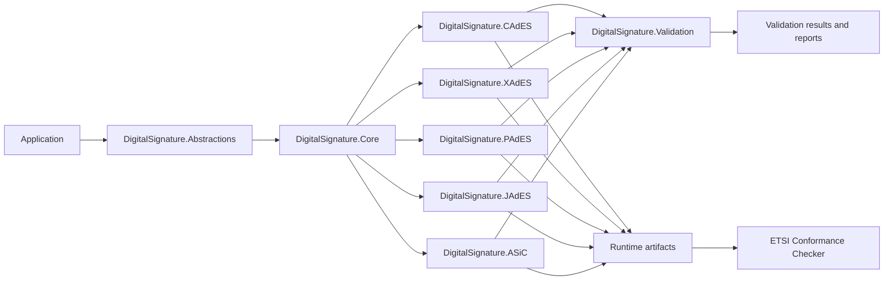

# DigitalSignature


DigitalSignature is a .NET 10 digital signature toolkit for CAdES, XAdES, PAdES, JAdES, and ASiC-S.

It focuses on practical ETSI-style signing and validation flows, with local verification and runtime-generated artifacts checked against the ETSI Conformance Checker.

## Why this project?

DigitalSignature is built for teams that want one consistent .NET codebase for multiple ETSI-oriented signature formats instead of separate, format-specific implementations.

It is designed around a few practical goals:

- keep the programming model consistent across signature families
- generate real runtime artifacts, not only unit-test-only structures
- validate outputs locally and against the ETSI Conformance Checker
- share signing, timestamp, augmentation, and validation foundations across formats
- keep the codebase modular enough for package-oriented consumption

## Highlights

- Baseline-B, Baseline-T, and Baseline-LT support across the main signature families
- Local signing and validation with `RSA` and `X509Certificate2`
- ETSI checker verified interoperability for the current runtime artifact set
- JAdES support built around JSON General Serialization
- Shared validation and augmentation foundations for cross-format workflows

## Validation status

The current runtime artifact set passes both local verification and a fresh ETSI Conformance Checker sweep across all Baseline-B, Baseline-T, Baseline-LT, and Baseline-LTA rows below.

| Format | Baseline-B | Baseline-T | Baseline-LT | Baseline-LTA | Local Validation | ETSI Checker | Notes |
|---|---:|---:|---:|---:|---|---|---|
| CAdES | Yes | Yes | Yes | Yes | Pass (B/T/LT/LTA) | Pass (B/T/LT/LTA) | LTA uses `archiveTimestampV3` with embedded `ATSHashIndexV3` |
| XAdES | Yes | Yes | Yes | Yes | Pass (B/T/LT/LTA) | Pass (B/T/LT/LTA) | LTA uses `xades141:ArchiveTimeStamp` |
| PAdES | Yes | Yes | Yes | Yes | Pass (B/T/LT/LTA) | Pass (B/T/LT/LTA) | LTA uses PDF-level `DocTimeStamp` with `ETSI.RFC3161` |
| ASiC-S | Yes | Yes | Yes | Yes | Pass (B/T/LT/LTA) | Pass (B/T/LT/LTA) | LTA carries embedded CAdES-LTA inside the container |
| JAdES | Yes | Yes | Yes | Yes | Pass (B/T/LT/LTA) | Pass (B/T/LT/LTA) | Primary artifact is JSON General Serialization; LTA uses `arcTst` |

## Architecture overview



## Build and test

```bash
dotnet restore DigitalSignature.slnx
dotnet build DigitalSignature.slnx
dotnet test DigitalSignature.slnx
```

## Quick example

```csharp
using System.Security.Cryptography;
using System.Security.Cryptography.X509Certificates;
using DigitalSignature.Abstractions;
using DigitalSignature.CAdES;
using DigitalSignature.Core;

byte[] payload = "hello"u8.ToArray();
using RSA rsa = RSA.Create(2048);

var certificateRequest = new CertificateRequest(
    "CN=DigitalSignature Demo",
    rsa,
    HashAlgorithmName.SHA256,
    RSASignaturePadding.Pkcs1);

using X509Certificate2 certificate = certificateRequest.CreateSelfSigned(
    DateTimeOffset.UtcNow.AddDays(-1),
    DateTimeOffset.UtcNow.AddYears(1));

var suite = new SignatureSuite(
    SignatureAlgorithmIdentifier.RsaPkcs1,
    HashAlgorithmIdentifier.Sha256,
    2048,
    IsRecommended: true);

var request = new SignatureRequest(
    SignatureFormat.CAdES,
    SignatureLevel.BaselineB,
    payload,
    MimeType: "text/plain");

var service = new CAdESBaselineBService();
var signature = service.CreateDetachedSignature(request, certificate, rsa, suite);
var validation = service.VerifyDetachedSignature(payload, signature.Data);

Console.WriteLine(validation.Conclusion);
```

## NuGet-friendly module layout

The solution is already split into package-sized modules, so consumers can take only the parts they need.

- `DigitalSignature.Abstractions`
- `DigitalSignature.Core`
- `DigitalSignature.CAdES`
- `DigitalSignature.XAdES`
- `DigitalSignature.PAdES`
- `DigitalSignature.JAdES`
- `DigitalSignature.ASiC`
- `DigitalSignature.Validation`

A typical consumer shape looks like this:

- **CAdES only**: `Abstractions + Core + CAdES`
- **PAdES with validation**: `Abstractions + Core + CAdES + PAdES + Validation`
- **JAdES only**: `Abstractions + Core + JAdES + Validation`
- **Full toolkit**: all format modules plus `Validation`

Today, the repository is consumed directly from source/projects. The current module boundaries are intentionally aligned for clean future package publication.

## Repository layout

- `src/DigitalSignature.Abstractions` - shared contracts and signature models
- `src/DigitalSignature.Core` - shared signing, timestamp, and augmentation infrastructure
- `src/DigitalSignature.CAdES` - CMS/CAdES generation and validation helpers
- `src/DigitalSignature.XAdES` - XML/XAdES generation and validation helpers
- `src/DigitalSignature.PAdES` - PDF/PAdES generation, DSS, and verification helpers
- `src/DigitalSignature.JAdES` - JOSE/JAdES generation and validation helpers
- `src/DigitalSignature.ASiC` - ASiC-S container generation and validation helpers
- `src/DigitalSignature.Validation` - validation pipeline and reporting components
- `tests/` - unit, integration, and runtime smoke tests

## Scope and non-goals

DigitalSignature currently targets:

- local signing workflows based on `RSA` and `X509Certificate2`
- Baseline-B, Baseline-T, and Baseline-LT artifact generation across all main families
- local Baseline-LTA coverage across CAdES-LTA, ASiC-S-LTA, PAdES-LTA, XAdES-LTA, and JAdES-LTA
- local verification and ETSI-oriented interoperability checks

It is not yet positioned as a full production PKI platform for:

- HSM or KMS backed signing
- remote signing services
- trust-list distribution or full production trust management

## Notes

- For JAdES, the primary persisted artifact is JSON General Serialization.
- Compact JWS output is kept as a helper output for Baseline-B scenarios.
- ETSI checker results are conformance-oriented and should be interpreted separately from full trust-store policy decisions.
